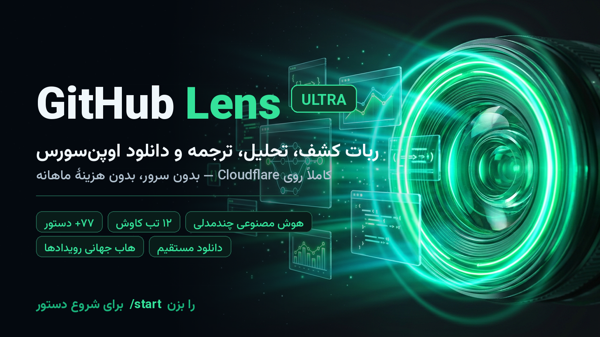
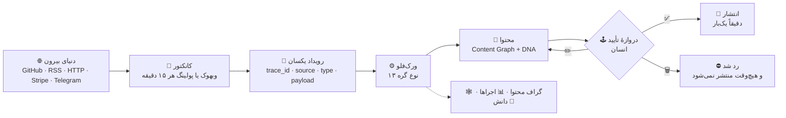
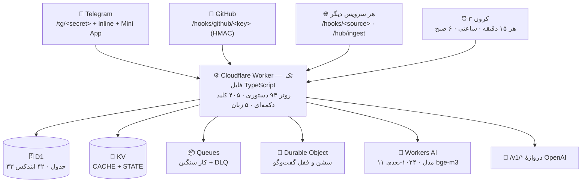

<div align="center" dir="rtl">


# 🔭 GitHub Lens Ultra

**ایستگاهِ کاوشِ اوپن‌سورس: پیدا کردن، تحلیل، ترجمه، امنیت و دانلود — و یک هابِ جهانی که خودش رویداد می‌گیرد، ورک‌فلو می‌سازد و با اجازهٔ تو منتشر می‌کند.**

**کاملاً روی کلودفلر (Cloudflare Workers) — بدون سرور، بدون خواب، بدون هزینهٔ ماهانه.**

[](https://github.com/Alisarani7021/ghlens-ultra/actions/workflows/ci.yml)
[](https://github.com/Alisarani7021/ghlens-ultra/actions/workflows/deploy.yml)
[](#-دروازهٔ-کیفیت)
[](https://www.typescriptlang.org/)
[](https://workers.cloudflare.com/)
[](schema/d1.sql)
[](#-زبانها)
[](LICENSE)
[](https://t.me/Gitguts_bot)

**[🤖 ربات](https://t.me/Gitguts_bot)** ·
**[🩺 سلامت زنده](https://ghlens-ultra.gitguts.workers.dev/health)** ·
**[📖 راهنمای فارسی کاربر](docs/USAGE-FA.md)** ·
**[🏛 معماری](docs/ARCHITECTURE.md)** ·
**[🌌 هاب جهانی](docs/HUB-OS.md)**

</div>

<div dir="rtl">



</div>

> [!NOTE]
> **این ربات همین حالا زنده است.** سرویس‌ورکر روی `https://ghlens-ultra.gitguts.workers.dev` منتشر می‌شود (هر پوش به `main`)، و هفت بررسی عمیق سلامت — D1، KV، تلگرام، گیت‌هاب، AI، جست‌وجوی معنایی، صف و Durable Object — سبز است.

---

<div dir="rtl">

## ⚡ در ۳۰ ثانیه ببین

```
«یک کتابخانه سبک برای صف در Go»       → جست‌وجوی معنایی، ترجمهٔ خودکار درخواست
vuejs/core                             → پروندهٔ کامل: ۱۲ تب، امنیت، جامعه، انتشارها
/repochat oven-sh/bun                  → چت با خود مخزن، با منبع
/dl oven-sh/bun @v1.2.3 tar            → دانلود مستقیم سورس
/translate langchain-ai/langchain       → README فارسی، ساختار دست‌نخورده
/scout anthropics/claude-code           → رشد، ضریب اتوبوس، نرخ مرج، هشدار امنیتی
```

و یک چیز که ربات‌های دیگر ندارند: **یک رویداد بیرونی می‌آید → ورک‌فلو اجرا می‌شود → پست کانال آماده می‌شود → تو فقط ✅ می‌زنی.**

---

## 📚 فهرست

| # | بخش |
|---|---|
| ۱ | [چرا این ربات؟](#۱-چرا-این-ربات) |
| ۲ | [قابلیت‌ها](#۲-قابلیتها) |
| ۳ | [هاب جهانی — از رویداد تا انتشار](#۳-هاب-جهانی--از-رویداد-تا-انتشار) |
| ۴ | [معماری](#۴-معماری) |
| ۵ | [اعداد واقعی پروژه](#۵-اعداد-واقعی-پروژه) |
| ۶ | [راه‌اندازی](#۶-راهاندازی-سه-راه) |
| ۷ | [زبان‌ها](#۷-زبانها) |
| ۸ | [دروازهٔ کیفیت](#۸-دروازهٔ-کیفیت) |
| ۹ | [مرزهای صادقانه](#۹-مرزهای-صادقانه) |
| ۱۰ | [نقشهٔ مخزن](#۱۰-نقشهٔ-مخزن) |
| ۱۱ | [مجوز و اعتبار](#۱۱-مجوز-و-اعتبار) |
| — | [English](#english) |

---

## ۱. چرا این ربات؟

اکثر ربات‌های «گیت‌هاب» یک کار می‌کنند: اسم مخزن را می‌گیری، لینک می‌دهند. این یکی چهار کار می‌کند که هیچ‌کدام دکور نیست:

| کار | چطور انجام می‌شود |
|---|---|
| 🔍 **می‌فهمد منظورت چیست** | جست‌وجوی هیبرید: برداری (bge-m3، ۱۰۲۴ بعد) + متنی، ادغام با RRF، و درخواست فارسی خودکار به کوئری گیت‌هاب ترجمه می‌شود. بردارها **داخل D1** ذخیره می‌شوند، پس جست‌وجوی معنایی بدون هیچ سرویس اضافه کار می‌کند. |
| 🛰 **مخزن را کالبدشکافی می‌کند** | ۱۲ تب از **یک کوئری GraphQL**: نمای کلی، رشد ۳۰ روزه، زبان‌ها، ضریب اتوبوس، ریلیزها، ایشوها، PRها، باستان‌شناسی کامیت، CI، امنیت، چنج‌لاگ نوشته‌شده، رادار مشارکت. |
| 🛡 **دروغ نمی‌گوید** | هر عدد از API گیت‌هاب، OSV.dev، RDAP یا DNS-over-HTTPS می‌آید. مدل زبانی فقط می‌نویسد و ترجمه می‌کند؛ هیچ آماری را از خودش نمی‌سازد. |
| 🌌 **خودش کار می‌کند** | هاب: رویداد می‌گیرد (وبهوک/پولینگ)، ورک‌فلو اجرا می‌کند، محتوا می‌سازد، و **قبل از انتشار از تو اجازه می‌گیرد**. |

---

## ۲. قابلیت‌ها

<details open>
<summary><b>🔍 کشف و کاوش</b></summary>

| فرمان | چه می‌کند |
|---|---|
| `/search [موضوع]` | جست‌وجوی هیبرید معنایی + متنی، فیلتر پیشرفته، ذخیرهٔ جست‌وجو |
| `/trending` | روزانه/هفتگی/ماهانه/همیشه × ۱۸ زبان، با **رشد واقعی** از اسنپ‌شات هر ۱۵ دقیقه |
| `/browse` | مرور دسته‌بندی‌شده: AI، امنیت، دواپس، وب، موبایل، OSINT، بازی… |
| `/gems` · `/random` · `/map` · `/feed` | گنج‌های پنهان، کشف وزن‌دار بر اساس علاقه، نقشه، فید شخصی |
| `/scout owner/repo` | پروندهٔ ۱۲ تبی |
| `/compare a/b c/d` | مقایسهٔ تنگاتنگ با جدول + حکم AI |
| `/changelog` · `/chart` · `/files` · `/card` · `/similar` | چنج‌لاگ انسانی، نمودار رشد، مرورگر فایل داخل تلگرام، کارت اشتراک‌گذاری، مخازن مشابه |
| `/arch owner/repo` | تحلیل معماری و توضیح لایه‌ها |

</details>

<details>
<summary><b>🤖 هوش مصنوعی (۱۱ مدل، ۳ رده، به‌علاوهٔ ردهٔ چندمدلی)</b></summary>

ردهٔ `fast` برای کارهای ارزان، `smart` برای نوشتن و تحلیل، `code` برای کد، و `mesh` که چند مدل را موازی می‌گیرد و با داور + سنتز جمع می‌کند.

| فرمان | چه می‌کند |
|---|---|
| `/ask [سؤال]` | دستیار با دادهٔ زندهٔ گیت‌هاب |
| `/repochat owner/repo` | چت با محتوای مخزن (RAG روی README و `docs/`) **با منبع و استناد** |
| `/ai owner/repo` | پروندهٔ ساختاریافته: چیست، برای کی، قوت/ضعف، جایگزین‌ها |
| `/translate owner/repo` | ترجمهٔ README با حفظ ساختار (کد و YAML دست‌نخورده)، صفحه‌بندی تا آخر، کش |
| `/workflow [توضیح]` | ساخت GitHub Actions واقعی |
| `/review owner/repo#12` | بازبینی PR |
| `/code` · `/chat` · `/analyze` | توضیح کد، گفت‌وگو، تحلیل |
| `/vs a/b c/d` | دو مدل، دو نظر، یک جمع‌بندی |
| `/appgen` | ساخت اسکلت اپ از یک توضیح |
| **دروازهٔ AI** | `/v1/chat/completions` سازگار با OpenAI (و `/v1/models`) — با کلید اختصاصی، شامل استریم SSE |

**استخر کلیدهای اهدایی:** کاربران کلید خودشان را می‌دهند (`/keys`)، اول تست می‌شود، بعد همه از آن استفاده می‌کنند. کلید سوخته فوراً از استخر حذف می‌شود. سقف روزانهٔ رایگان که تمام شود، ربات به‌جای خطا **دلیل** را می‌گوید.

</details>

<details>
<summary><b>📥 دانلود، امنیت و ابزار</b></summary>

| فرمان | چه می‌کند |
|---|---|
| `/dl owner/repo [@ref] [zip\|tar]` | دانلود مستقیم با کش، تقسیم خودکار برای مخزن‌های بزرگ (سقف آپلود تلگرام ۵۰MB است — ربات دورش **کار** می‌کند، نه اینکه وعدهٔ دورزدن بدهد) |
| `/security owner/repo` | اسکن وابستگی‌ها با OSV.dev |
| `/secrets owner/repo` | شکار کلید و توکن لو‌رفته |
| `/scan` · `/cve` | اسکن کامل مخزن با نمرهٔ ۰–۱۰۰ · هشدارهای تازه |
| `/tools` · `/pkgconvert` | تبدیل پکیج (deb ⇄ rpm ⇄ pkg.tar.zst ⇄ apk) و ابزارهای شبکه |
| `/ip` · `/asn` · `/cidr` · `/jwt` · `/hash` · `/cron` · `/dev` | ۲۰ ابزار توسعه: IP/DNS/ASN/TLS، CIDR، JWT، هش، UUID، رجکس، SemVer، رنگ، .gitignore |
| `/netradar` | رادار شبکه و منابع آزادی اینترنت |
| `/hf` | ❌ **حذف شده** — Hugging Face به خواست مالک پروژه از ربات بیرون رفت |

</details>

<details>
<summary><b>👤 حساب، جامعه و مشارکت</b></summary>

`/profile` پروفایل، سطح، نشان و رتبه · `/dashboard` آمار ۳۰ روزه، استریک، مصرف AI · `/favorites` · `/subs` · `/interests` · `/leaderboard` · `/refer` (دعوت دوستان = XP) · `/contribute` فرصت‌های مشارکت + راهنمای اولین PR + برنامهٔ ۷ روزه · `/issues` · `/firstpr` · `/invite` · `/language` تغییر زبان.

</details>

<details>
<summary><b>🔌 کانکتور گیت‌هاب (وبهوک + پولینگ)</b></summary>

`/connect` یک لینک توکن می‌سازد که دسترسی‌های لازم از قبل تیک خورده‌اند؛ توکن را می‌فرستی و حساب وصل می‌شود. بعد از آن ریلیز، ایشو، PR، کامیت، هشدار امنیتی و استارز از طریق **وبهوک** (نه پولینگ کند) می‌آید، و سقف ۵٬۰۰۰ درخواست در ساعت با کش ETag مدیریت می‌شود.

</details>

---

## ۳. هاب جهانی — از رویداد تا انتشار

<div dir="rtl">

این بخش قلب پروژه است و قانونش یک جمله است:

> **سرویس جدید؟ → کانکتور → رویداد + اکشن → گذرگاه جهانی.**
> هیچ‌چیز به روتر ربات چسبانده نمی‌شود؛ همه‌چیز روی یک گذرگاه رویداد سوار می‌شود.

</div>



<details open>
<summary><b>🕹 صف تأیید — مسیر طلایی</b></summary>

```
🔔 پیش‌نویس آماده است
🚀 انتشار نسخهٔ جدید منتشر شد
┌ oven-sh/bun
├ Bun v1.2.3
└ v1.2.3 · ۱ مهر ۱۴۰۴

«چند خط خلاصهٔ خوانا از تغییرات، نوشته‌شده توسط مدل»

⬇️ دانلود — 🍎 مک ×۲ · 🐧 لینوکس ×۲ · 🪟 ویندوز ×۱
[ هر دارایی، دکمهٔ خودش ]  ← یک دکمه برای هر فایل انتشار
[ 🔗 لینک پروژه ]          ← و یک دکمه به خود پروژه
```

زیر همان پیام: **✅ انتشار** · **✏️ ویرایش متن** · **🗑 رد**.

* ✅ → دقیقاً **یک** پست منتشر می‌شود (تضمین تک‌ناشر، زنده تست شده: فقط یک `sendMessage`).
* ✏️ → متن جایگزین بفرست؛ نسخهٔ محتوا یک پله بالا می‌رود و کارت تأیید دوباره می‌آید.
* 🗑 → محتوا `blocked` می‌شود، ورک‌فلو بسته می‌شود و اجرای معلق نمی‌ماند.

</details>

<details>
<summary><b>۱۸ صفحهٔ هاب (از <code>/hub</code>)</b></summary>

| صفحه | کار |
|---|---|
| 🧪 مأموریت | یک جمله در زبان طبیعی بگو؛ خودش ورک‌فلو می‌سازد و اجرا می‌کند |
| 📚 برنامه‌های آماده | ریلیز→کانال · خلاصهٔ RSS · هشدار تغییر صفحه |
| 🔌 کانکتورها | گیت‌هاب / RSS / HTTP / تلگرام + تست واقعی + «دریافت الان» |
| 🎯 رویدادها | رویدادهای رسیده + «🧪 رویداد آزمایشی» برای تست کل مسیر |
| 🕹 صف تأیید | پیش‌نویس‌های منتظر تصمیم تو |
| ⚙️ ورک‌فلوها | ساخت، فعال/غیرفعال، اجرای دستی |
| 🕸 گراف محتوا | نسخه‌ها، DNA، وضعیت STALE |
| 📊 اجراها | گره‌به‌گره: چه شد، چند میلی‌ثانیه، با چه نتیجه‌ای |
| 🧠 دانش و جست‌وجو | گراف دانش + جست‌وجوی معنایی بدون کلیدواژه |
| 🏷 موجودیت‌ها | استخراج موجودیت‌ها از محتوا |
| 📄 کالبدشکافی فایل | فایل بفرست: متن، ساختار، موجودیت‌ها، بردار جست‌وجو، گزیده |
| 🖼 کارخانهٔ رسانه | کاور SVG + پرامپت تصویر انگلیسی + متن جانشین فارسی |
| 📡 یکپارچه‌سازی · 🛠 وبهوک و گیت‌وی | آدرس وبهوک هر سرویس + دروازهٔ سازگار با OpenAI |
| 🚀 ساخت نمونهٔ شخصی | کپی ربات روی حساب کلاودفلر خودت، یک‌کلیکی |
| 📖 راهنما | از کجا چه کاری |

</details>

<details>
<summary><b>لایه‌های هاب (۱۷ ماژول)</b></summary>

```
src/hub/
├── event.ts       پاکت رویداد یکسان + trace_id + شناسه‌های یکتا
├── connectors.ts  گیت‌هاب / RSS / HTTP / تلگرام + پولینگ
├── bus.ts         گذرگاه: رویداد → ورک‌فلوهای مشترک
├── engine.ts      ۱۳ نوع گره: trigger · ai · compose.release · http · transform ·
│                  condition · policy · content · approval · connector · notify ·
│                  delay · stop — با اجرای مجدد از دروازه
├── playbooks.ts   برنامه‌های آماده
├── policy.ts      سیاست: تکرار، خفه‌سازی، سکوت، اجازهٔ انتشار
├── content.ts     Content Graph + Content DNA + STALE
├── editor.ts      متن کانال: هدر، نقل‌قول، خط دانلود، دکمه‌ها
├── mesh.ts        چند مدل → داور → سنتز
├── mission.ts     زبان طبیعی → ورک‌فلو
├── knowledge.ts   گراف دانش + جست‌وجوی معنایی
├── files.ts       کالبدشکافی فایل (متن، PDF، موجودیت، بردار)
├── media.ts       کارخانهٔ رسانه (SVG، پرامپت، alt)
├── hooks.ts       دریافت‌کنندهٔ وبهوک با HMAC (GitHub / Stripe / عمومی)
├── gateway.ts     دروازهٔ سازگار با OpenAI
└── deploy.ts      ساخت نمونهٔ شخصی، یک‌کلیکی (توکن → منابع → آپلود → وبهوک → سلامت)
```

**امنیت وبهوک:** امضای غلط یا نبوده ⇒ **۴۰۱ قبل از پارس کردن بدنه**. مقایسهٔ امضا در زمان ثابت انجام می‌شود تا بایت‌به‌بایت حدس زدنی نباشد. رویداد تکراری با شناسه رد می‌شود.

</details>

---

## ۴. معماری



| لبه | نقش |
|---|---|
| **Workers** | کل منطق، روتر، وبهوک‌ها، لندینگ، Mini App |
| **D1** | کاربران، مخازن، اسنپ‌شات ستاره، XP، محتوا، رویدادها، بردارها، لاگ ممیزی |
| **KV** | کش با ETag (پاسخ ۳۰۴ سهمیهٔ گیت‌هاب نمی‌خورد)، وضعیت، محتوای بلوب |
| **Queues + DLQ** | کار سنگین: اسنپ‌شات، اسکن امنیت، اعلان‌ها |
| **Durable Objects** | سشن کاربر + قفل تا دو درخواست هم‌زمان گم نشوند |
| **Workers AI** | سه ردهٔ مدل + ردهٔ چندمدلی + embedding |
| **Cron** | پولینگ کانکتورها، بردها، خلاصهٔ صبحگاهی، پاکسازی |

---

## ۵. اعداد واقعی پروژه

| چه | چند |
|---|---|
| فرمان‌های متنی (با نام‌های مستعار) | **۹۳** |
| کلیدهای دکمه‌ای یکتا | **۴۰۵** |
| فایل TypeScript | **۶۵** فایل · **~۲۰٬۸۰۰** خط |
| ماژول هاب / ماژول قابلیت | **۱۷** / **۲۲** |
| جدول و ایندکس D1 | **۳۳** جدول · **۴۲** ایندکس |
| تست خودکار | **۲۳۶** (همه سبز) |
| زبان رابط کاربری | **۵** |
| کرون | **۳** |
| سرویس کلودفلر درگیر | **۶** (Workers · D1 · KV · Queues · DO · Workers AI) |

---

## ۶. راه‌اندازی (سه راه)

**۱) بی‌دردسرترین — از داخل خود ربات:**
تنظیمات → 🌌 هاب جهانی → 🚀 **ساخت نمونهٔ شخصی** → لینک توکن کلودفلر (دسترسی‌ها از قبل تیک خورده) → توکن را بفرست. ربات خودش KV، D1، صف و ورکر را می‌سازد، جدول‌ها را می‌ریزد، وبهوک را وصل می‌کند و سلامت را چک می‌کند.

**۲) با CI/CD گیت‌هاب:** دو سکرت در مخزن بگذار (`CLOUDFLARE_API_TOKEN`, `CLOUDFLARE_ACCOUNT_ID`) — از آن به بعد هر پوش به `main` تست، انتشار و تست سلامت را خودکار انجام می‌دهد.

**۳) دستی:**

```bash
git clone https://github.com/Alisarani7021/ghlens-ultra && cd ghlens-ultra
npm ci

# منابع کلودفلر + اسکیمای D1 + انتشار
export CLOUDFLARE_API_TOKEN=…  CLOUDFLARE_ACCOUNT_ID=…
./scripts/bootstrap.sh

# سکرت‌ها و وبهوک
export BOT_TOKEN=… GITHUB_TOKEN=… CF_ACCOUNT_ID=… CF_API_TOKEN=…
./scripts/set-secrets.sh
npx wrangler deploy
WORKER_URL=https://ghlens-ultra.<sub>.workers.dev ./scripts/set-webhook.sh

# وبهوک گیت‌هاب (اختیاری):  <worker>/hooks/github/<key>
curl https://ghlens-ultra.<sub>.workers.dev/health
```

راهنمای گام‌به‌گام با عیب‌یابی: [`docs/DEPLOY.md`](docs/DEPLOY.md) · راهنمای کاربر فارسی: [`docs/USAGE-FA.md`](docs/USAGE-FA.md)

---

## ۷. زبان‌ها

رابط ربات کامل پنج‌زبانه است — **فارسی · انگلیسی · عربی · روسی · چینی** — نه به‌صورت نمایشی: منوها، دکمه‌ها، پیام‌های خطا، راهنما و منوی فرمان‌های تلگرام همه ترجمه شده‌اند. زبان مدل هم مستقل است: ترجمهٔ README با حفظ ساختار، و مسیرهای AI بر اساس زبان کاربر انتخاب می‌شوند.

---

## ۸. دروازهٔ کیفیت

```bash
bash scripts/check.sh
# ▸ gen-schema  → src/hub/schema.gen.ts از schema/d1.sql ساخته می‌شود (۷۵ دستور، ۳۳ جدول، ۴۲ ایندکس)
# ▸ typecheck   → TypeScript strict، صفر خطا
# ▸ sqlcheck    → تعداد جای‌گاه‌های ? با تعداد bind() در هر دستور SQL
# ▸ dup-keys    → هیچ کلید دکمه‌ای دوبار تعریف نشده (۴۰۵ کلید یکتا)
# ▸ selftest    → ۲۳۶ تست الگوریتمی
```

همین دروازه در CI روی هر پوش و PR اجرا می‌شود؛ همین دکمه‌ها روی دادهٔ واقعی سرویس‌ورکر منتشرشده بررسی می‌شوند.

---

## ۹. مرزهای صادقانه

این‌ها را می‌نویسیم چون واقعی‌اند — نه برای فروتنی، برای اینکه جای تعجب نماند:

| مرز | واقعیت |
|---|---|
| 🎙 **صدا** | **کاملاً حذف شد** (پادکست، خوانش پاسخ، هر خروجی صوتی) — به خواست مالک پروژه. تنها جایی که صدا هست، **ورودی** است: یک ویس می‌فرستی و به متن تبدیل می‌شود. |
| 📦 سقف آپلود تلگرام | ۵۰MB. راه‌حل: تقسیم جریانی؛ برای مخزن‌های غول، آفلاود به یک مخزن کمکی Actions (اختیاری). هیچ رباتی این محدودیت را «دور نمی‌زند». |
| 🧠 سهمیهٔ رایگان AI | روزانه است. زنجیرهٔ جایگزین ۱۱ مدلی + کش تهاجمی + کلیدهای اهدایی کاربران. تمام شود، ربات دلیل را می‌گوید و خاموش نمی‌شود. |
| 🖼 تصاویر | فهرست می‌شوند، **توصیف AI نمی‌شوند** (تصمیم عمدی). |
| 📄 PDF اسکن‌شده | OCR ندارد؛ متن‌دار خوانده می‌شود و اگر متن نداشت، همان را صادقانه می‌گوید. |
| 🔌 `/v1/embeddings` | مسیر HTTP ندارد؛ embedding داخلی است (بردارها در D1). |
| ⏰ سقف کرون | کل حساب پنج کرون دارد؛ این پروژه سه‌تا را می‌خواهد. |
| 🚫 **خارج از دامنه** | هیچ ابزار دوکسینگ/OSINT روی افراد واقعی ساخته نمی‌شود — درخواستش هم رد شده است. |

---

## ۱۰. نقشهٔ مخزن

```
ghlens-ultra/
├── src/
│   ├── index.ts          ورود، روتر، وبهوک، دروازهٔ OpenAI، سلامت، لندینگ
│   ├── env.ts            تایپ بایندینگ‌ها
│   ├── tg/               کلاینت Bot API، کیبوردها (۵ زبان)
│   ├── github/           REST با ETag · GraphQL ۱۲ تب · ترند · OSV
│   ├── ai/               زنجیرهٔ ۱۱ مدل · استخر کلید · بردار
│   ├── core/             D1 · KV · سشن (DO) · صف · کرون · اتاق‌های اصلی
│   ├── features/         ۲۲ ماژول کاربری (کاوش، جست‌وجو، ترجمه، دانلود، ابزار…)
│   └── hub/              ۱۷ ماژول هاب جهانی
├── schema/d1.sql         ۳۳ جدول (منبع حقیقت اسکیما)
├── scripts/              bootstrap · set-secrets · set-webhook · check.sh · selftest
├── actions/pack-repo.yml مخزن کمکی برای بسته‌بندی مخزن‌های بزرگ
└── docs/                 ARCHITECTURE · DEPLOY · FEATURES · HUB-OS · USAGE-FA · LIVE · PUBLISH
```

---

## ۱۱. مجوز و اعتبار

کد این پروژه با پروانهٔ **MIT** منتشر شده — استفادهٔ شخصی و سازمانی آزاد است (فایل [LICENSE](LICENSE)).

داده‌ها از APIهای عمومی گیت‌هاب، OSV.dev، RDAP، DNS-over-HTTPS و منابع آزاد می‌آید و تابع شرایط خودشان است. فونت [Vazirmatn](https://github.com/rastikerdar/vazirmatn) برای تصاویر پروژه استفاده شده است.

<div align="center">

**ساخته‌شده برای اینکه گیت‌هاب فارسی‌زبان‌ها یک ایستگاه واقعی داشته باشد.**

⭐ اگر به کارت آمد، استار بده — و اگر ایده‌ای داری، ایشو باز کن.

</div>

</div>

---

<a id="english"></a>

# 🇬🇧 English

<div align="center">

**GitHub Lens Ultra** — an open-source observatory for Telegram: discover, analyse, translate, audit and download GitHub projects, plus a universal event hub that watches the internet, drafts channel content, and publishes only when a human says yes. **Entirely on Cloudflare Workers.**

[🤖 Bot](https://t.me/Gitguts_bot) · [🩺 Live health](https://ghlens-ultra.gitguts.workers.dev/health) · [🏛 Architecture](docs/ARCHITECTURE.md) · [🌌 Hub OS](docs/HUB-OS.md)

</div>

## What it does

* **🔍 Discovery** — hybrid semantic + lexical search (`/search`), real-growth trending boards (`/trending`), curated browsing, hidden gems, weighted random, personal feed. Embeddings are 1024-dim `bge-m3` stored **inside D1**, so semantic search needs no extra service.
* **🛰 Analysis** — a 12-tab dossier from a single GraphQL query: overview, 30-day growth, languages, bus factor, releases, issues, pull requests, commit archaeology, CI, security, generated changelog, contribution radar. Compare repos, chart stars, browse files, chat with a repository (RAG with citations).
* **🤖 AI** — 11 Workers AI models in 3 tiers plus a multi-model jury (`mesh`), generous caching, and a donated-key pool with automatic eviction of dead keys. An **OpenAI-compatible gateway** (`/v1/chat/completions`, `/v1/models`, SSE streaming) is exposed with its own API keys.
* **📥 Download & audit** — direct source downloads with caching and automatic splitting, OSV dependency scans, leaked-secret hunting, CVE alerts, and a package converter (deb ⇄ rpm ⇄ pacman ⇄ apk).
* **🌌 Universal hub** — the architecturally interesting half.

## The hub: event → workflow → content → approval → publish

The rule is one sentence: **a new service becomes a connector, then events and actions, then everything rides the same bus.** Nothing is bolted onto the bot's router.

* **Connectors** (github · rss · http · telegram) either receive webhooks or get polled every 15 minutes. An inbound webhook and a polled connector produce the **same event envelope** with a `trace_id`, so nothing downstream knows which way it arrived.
* **Workflows** run 13 node kinds (`trigger`, `ai`, `compose.release`, `http`, `transform`, `condition`, `policy`, `content`, `approval`, `connector`, `notify`, `delay`, `stop`) and resume from the approval gate.
* **Content Graph + Content DNA + STALE** keep content versioned and traceable back to its source event.
* **The approval gate** is the point: the owner sees the exact post with **one download button per release asset plus a project link**, and can ✅ publish, ✏️ edit, or 🗑 reject. Exactly one publisher is guaranteed — verified live that an approval produces a single channel message.
* **Layers on top**: knowledge graph with semantic search, file dissection (text, PDF, entities, embeddings, excerpts), media factory (SVG cover, image prompt, alt text), an HMAC webhook receiver (GitHub/Stripe/generic, 401 before parsing, constant-time compare, replay rejection), and one-click self-hosting that provisions KV, D1, Queues, the worker, secrets, crons and the Telegram webhook on someone else's Cloudflare account.

## Numbers (all measured, not marketing)

93 text commands (including aliases) · 405 unique callback keys · 65 TypeScript files, ~20,800 lines · 17 hub modules · 22 feature modules · 33 D1 tables and 42 indexes · 236 automated tests, all green · 5 UI languages · 3 cron triggers · 6 Cloudflare services.

## Quality gate

`bash scripts/check.sh` regenerates the schema module from `schema/d1.sql`, typechecks in strict mode, verifies that every SQL statement's `?` count matches its `bind()` arity, proves no callback key is defined twice, and runs 236 algorithmic tests. CI runs the same gate on every push and pull request, and the deploy workflow ships to Workers and then smoke-tests the live worker.

## Honest limits

**Audio was removed entirely** by owner instruction (podcast, spoken answers, every audio output); the only audio left is input — send a voice note and it becomes text. Telegram's upload cap is 50 MB, so big repositories are split and optionally offloaded to a helper Actions repo. The free Workers AI neuron quota is daily, so 11 models are chained with aggressive caching and user-donated keys. Images are catalogued but deliberately **not** AI-described. Scanned PDFs are not OCR'd and the bot says so. There is no HTTP `/v1/embeddings` route. And no doxxing or OSINT-on-real-people tooling exists here — that request was refused.

## License

MIT © 2026 — see [LICENSE](LICENSE). Data comes from public GitHub APIs, OSV.dev, RDAP and DNS-over-HTTPS, each under its own terms.

<div align="center">

**⭐ star it if it's useful — and open an issue if you have an idea.**

</div>
