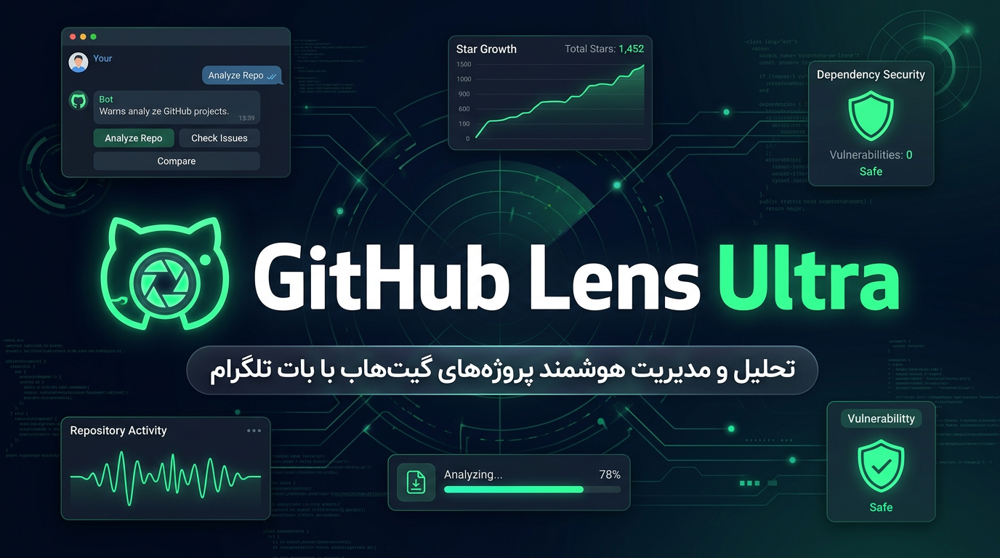

<div dir="rtl">



# 🔭 GitHub Lens Ultra

[](https://github.com/Alisarani7021/ghlens-ultra/actions/workflows/ci.yml)
[](https://github.com/Alisarani7021/ghlens-ultra/actions/workflows/deploy.yml)
[](https://www.typescriptlang.org/)
[](https://workers.cloudflare.com/)
[](#مجوز)

> ### 🟢 زنده و در حال اجرا — و روی گیت‌هاب
> 📦 مخزن: **[github.com/Alisarani7021/ghlens-ultra](https://github.com/Alisarani7021/ghlens-ultra)** — با CI/CD: هر پوش به `main` تست می‌شود، منتشر می‌شود و سلامت زنده چک می‌شود.
> ربات: [@Gitguts_bot](https://t.me/Gitguts_bot) · Worker: `https://ghlens-ultra.gitguts.workers.dev` · سلامت: `/health` · مینی‌اپ: `/app`
> گزارش کامل استقرار، تست‌ها، محدودیت‌ها و کارهای باقی‌مانده: **[docs/LIVE.md](docs/LIVE.md)**
>
> استقرار از اکانت کلادفلر قبلی منتقل شد، چون روی آن اکانت زیردامنه‌ی `*.workers.dev` از سمت خود کلادفلر خراب بود (هر اسکریپت، حتی «hello world»، خطای ۱۱۰۱ می‌گرفت). روی اکانت فعلی، همان تست سال اول `probe-ok` برمی‌گرداند.

**ربات تلگرامِ کشف، تحلیل و دانلود اوپن‌سورس — کاملاً روی Cloudflare.**
گسترش‌یافته‌ی GitHub Lens با معماری‌ای که هر قابلیتش روی دادهٔ واقعی سوار است.

| | |
|---|---|
| 🧩 **۷۷ دستور** | ۱۳۷ اکشن دکمه‌ای، ۲۷ صفحه/تب اختصاصی |
| 🏗 **۳۵ فایل TypeScript** | ‏~۸٬۸۰۰ خط کد، ۰ خطای تایپ‌چک |
| 🗄 **۲۰ جدول D1** | اسنپ‌شات ستاره‌ها، اشتراک‌ها، XP، لاگ وبهوک، ممیزی AI |
| ⚡ **۸ سرویس Cloudflare** | Workers · D1 · KV · Queues · Durable Objects · Workers AI (R2/Vectorize/Analytics آماده‌ی فعال‌سازی) |
| ✅ **۲۵ تست + گارد SQL** | `npm test` → ۲۵ تست الگوریتمی + پایش تعداد جایگاه‌های `?` در ۸۸ دستور SQL — همه سبز |

---

## ۱. چه فرقی با ربات قبلی دارد؟

ربات قبلی (همان ۹ قابلیت در اسکرین‌شات‌ها) یک «مرورگر گیت‌هاب» بود. این یکی یک **پلتفرم تحلیل** است:

| قابلیت ربات قبلی | در GitHub Lens Ultra |
|---|---|
| 🔍 جست‌وجو و دو زبانه | **جست‌وجوی هیبرید**: معنایی (Vectorize) + متنی (GitHub) با ادغام RRF، ترجمهٔ خودکار درخواست فارسی → کوئری گیت‌هاب، پیشنهاد جایگزین وقتی نتیجه‌ای نیست |
| 🔥 ترندها (روزانه/هفتگی/ماهانه/همیشه) | موتور رتبه‌بندی اختصاصی: **سرعت رشد × شتاب × کیفیت** با اسنپ‌شات هر ۱۵ دقیقه — پس «‎+۱٬۲۰۴ ستاره این هفته» عدد واقعی است، نه تخمین |
| 🧠 ترجمهٔ هوشمند README | ترجمهٔ ساختار‌حفظ‌کننده (کد و YAML دست‌نخورده)، صفحه‌بندی، کش ۳۰ روزه، خروجی HTML قابل چاپ |
| 🗂 بازرسی عمیق ۱۲ تب | همان ۱۲ تب + **یک کوئری GraphQL** برای همه‌شان: نمای کلی، رشد، زبان‌ها، جامعه، ریلیزها، ایشوها، PRها، باستان‌شناسی کامیت‌ها، CI، امنیت، چنج‌لاگ تولیدشده، رادار مشارکت |
| 📥 دانلود و تقسیم ZIP | **کش R2** (دانلود دوم فوری)، انتخاب برنچ/تگ، تقسیم جریانی بدون فشرده‌سازی مجدد، آفلاود خودکار به GitHub Actions برای مخازن ۱GB+ |
| 🧰 تبدیل پکیج و IP | همان + **ASN، DNS، TLS، رادار تهدید**؛ در بخش پکیج: deb ⇄ rpm ⇄ pkg.tar.zst ⇄ apk با دستورهای واقعی |
| ⭐ علاقه‌مندی و پروفایل | **گیمیفیکیشن:** XP، سطح، نشان، رتبهٔ هفتگی، استریک، ارجاع، داشبورد ۳۰ روزه، خروجی GDPR |
| 📚 راهنما | راهنمای دوزبانه + حالت inline + Mini App وب |

### چیزهایی که ربات قبلی اصلاً ندارد

- 🧠 **چت با مخزن (RAG)** — پاسخ از README و `docs/` با **استناد و منبع**
- 🛡 **امنیت واقعی** — اسکن وابستگی با **OSV.dev**، شکار کلید لو رفته، هشدار CVE لحظه‌ای
- 📡 **رادار شبکه** — IP/دامنه/ASN/گواهی + وضعیت تهدید (پروکسی/دیتاسنتر/موبایل)
- 🎙 **پادکست روزانه فارسی** — متن با LLM، صدا با Workers AI، تحویل در R2
- 🔔 **اشتراک ریلیز/امنیت/کامیت** — از طریق **GitHub Webhook**، نه polling کند
- 🛰 **کاوش عمیق** با نمودار رشد واقعی، ضریب اتوبوس، نرخ مرج، پیروی Conventional Commits
- ⚖️ **مقایسهٔ مخازن** با جدول، برندهٔ سلامت و حکم هوش مصنوعی
- ✨ **گنج‌های پنهان** و **کشف تصادفی** وزنی بر اساس علاقه‌مندی
- 🌱 **رادار مشارکت** + راهنمای اولین PR + برنامهٔ ۷ روزه
- 🖼 **کارت تصویری اشتراک‌گذاری** (Browser Rendering)
- 📊 **Mini App** برای وب (داشبورد، جست‌وجو، ترند)

---

## ۲. صفحه‌های اصلی

```
/start            → منوی ۱۷ دکمه‌ای + راه‌اندازی زبان (۵ زبان: fa en ar ru zh)
/search           → هیبرید معنایی/متنی، فیلتر پیشرفته، ذخیره جست‌وجو
/trending         → روزانه/هفتگی/ماهانه/همیشه × ۱۸ زبان + رهبران رشد + نمودار
/browse           → ۸ دسته × زیرشاخه، سازمان‌ها، افراد، سفر در زمان (۲۰۰۸–۲۰۲۶)، لیست‌های Awesome
/gems /random /map /feed
/scout owner/repo → ۱۲ تب (در ادامه)
/compare a/b c/d  → جدول مقایسه + حکم AI
/changelog /chart /files /card /similar
/ask /repochat /ai /translate /workflow /code /review
/dl owner/repo [@ref] [zip|tar]
/security /secrets /scan /cve
/ip /asn /tools /pkgconvert /dev
/profile /dashboard /favorites /subs /interests /leaderboard /refer /plan
/contribute /issues /firstpr
/podcast          → پادکست امروز (فارسی) + هفتگی + متن
/admin /flag      → پنل مدیریت، فلگ‌های زنده، پیام همگانی، تست AI
```

### ۱۲ تب کاوش عمیق (`/scout`)

| تب | چه چیزی می‌دهد |
|---|---|
| 📊 نمای کلی | آمار کامل، سلامت ۰–۱۰۰، هشدارهای قرمز، لینک بودجه/سایت |
| 📈 رشد | اسپارک‌لاین ۳۰ روزه، سرعت روزانه، فعالیت هفتگی کامیت |
| 🧩 زبان‌ها | توزیع بایت‌به‌بایت (Linguist) + نمودار میله‌ای |
| 👥 جامعه | **ضریب اتوبوس**، مشارکت‌کننده‌های برتر با سهم، چک‌لیست نگهداری |
| 🚀 ریلیزها | ریتم انتشار، دارایی‌ها، دانلودها، تگ‌های آخر |
| 🐞 ایشوها | نرخ بستن، موارد کهنه، برچسب‌های داغ، تازه‌ترین‌ها |
| 🔀 PRها | نرخ مرج، تعارض، اندازهٔ دیف، در انتظار بررسی |
| 🕒 کامیت‌ها | آخرین کامیت‌ها با آیکن نوع، درصد Conventional Commits |
| 🏗 CI | ورک‌فلوهای Actions، امتیاز بهداشت، چک‌لیست ۱۰ فایل حیاتی |
| 🛡 امنیت | هشدارهای گیت‌هاب + پرچم‌های ایمنی + دعوت به اسکن OSV |
| 📰 چنج‌لاگ | یادداشت انتشار انسانی از ۴۰ کامیت آخر (AI) |
| 🎯 مشارکت | آیتِم‌های مناسب شروع، نرخ پذیرش PR، مسیر عملی |

---

## ۳. معماری (همه چیز روی لبه)

```
┌─ Telegram ────────────────┐        ┌─ GitHub ─────────────────────┐
│  Webhook  /tg/<secret>    │        │  Webhook /gh-webhook (HMAC)  │
└───────────┬───────────────┘        └───────────┬──────────────────┘
            │  (ACK فوری، پردازش در waitUntil)     │
   ┌────────▼─────────────────────────────────────▼────────┐
   │                  Cloudflare Worker                     │
   │  src/index.ts  → روتر ۷۷ دستور + ۱۳۷ کالبک + inline   │
   ├───────────────┬───────────────┬───────────────────────┤
   │  D1 (۲۰ جدول) │  KV (CACHE/   │  R2: src/*، podcast/* │
   │  کاربر، مخزن، │  STATE، ETag) │  (لوکیشن ۳۰ روزه)     │
   │  اسنپ‌شات، XP  │               │                       │
   ├───────────────┼───────────────┼───────────────────────┤
   │ Vectorize     │ Workers AI    │ Queues + DO           │
   │ (bge-m3، 1024 │ (Llama 3.3    │ (کار سنگین + سشن      │
   │ dim, cosine)  │  70B/8B، Qwen،│  گفت‌وگو + قفل)        │
   │               │  Whisper، TTS)│                       │
   ├───────────────┴───────────────┴───────────────────────┤
   │ Cron: */15 · hourly · daily · weekly · monthly        │
   └───────────────────────────┬───────────────────────────┘
                               │ فقط برای مخازن ۱GB+
                      ┌────────▼─────────┐
                      │ GitHub Actions   │  7z چندپارت + ریلیز
                      │ (repo کمکی)      │
                      └──────────────────┘
```

جزئیات هر تصمیم در [`docs/ARCHITECTURE.md`](docs/ARCHITECTURE.md).

---

## ۴. راه‌اندازی در ۶ گام

```bash
git clone <this-repo> ghlens-ultra && cd ghlens-ultra
npm install

# ۱) منابع را بساز، wrangler.jsonc را پر کن، schema را اعمال کن و دیپلوی کن
export CLOUDFLARE_API_TOKEN=…  CLOUDFLARE_ACCOUNT_ID=…
./scripts/bootstrap.sh

# ۲) سکرت‌ها
export BOT_TOKEN=… BOT_USERNAME=… GITHUB_TOKEN=… CF_ACCOUNT_ID=… CF_API_TOKEN=…
./scripts/set-secrets.sh
npx wrangler deploy

# ۳) وبهوک تلگرام + منوی دستورها
export WORKER_URL=https://ghlens-ultra.<sub>.workers.dev
export TELEGRAM_WEBHOOK_SECRET=<from set-secrets.sh output>
./scripts/set-webhook.sh

# ۴) وبهوک گیت‌هاب (اختیاری ولی توصیه‌شده) — در مخزن دلخواه:
#    URL: <worker>/gh-webhook , Secret: GITHUB_WEBHOOK_SECRET
#    Events: releases, push, issues, pull_request, security_advisory, workflow_run, star

# ۵) سلامت
curl https://ghlens-ultra.<sub>.workers.dev/health   # همه باید true باشند

# ۶) در تلگرام: /start
```

راهنمای گام‌به‌گام با عیب‌یابی: [`docs/DEPLOY.md`](docs/DEPLOY.md).

---

## ۵. واقعیت‌ها (بدون وعدهٔ توخالی)

- **سقف آپلود تلگرام ۵۰MB است** (۴۹ برای راحتی). راه‌حل: تقسیم جریانی روی R2 و آفلاود ۷z به Actions. هیچ ربات تلگرامی نمی‌تواند این محدودیت را «دور بزند» — ما دورش *کار* می‌کنیم.
- **سهمیهٔ رایگان Workers AI روزانه است.** مدل‌ها با زنجیرهٔ جایگزین (۷۰B → ۸B → ۳B) و کش تهاجمی مدیریت می‌شوند؛ `/ask` و تحلیل روی مصرف‌شده‌ها لاگ می‌گیرد (`ai_usage`).
- **گیت‌هاب با توکن رایگان ۵٬۰۰۰ درخواست/ساعت** می‌دهد. کش ETag در KV باعث می‌شود پاسخ‌های ۳۰۴ سهمیه مصرف نکنند.
- **هرس داده:** اسنپ‌شات هر ۱۵ دقیقه فقط برای مخازن رصدشده/ترند گرفته می‌شود، نه همه‌چیز.
- **هیچ عددی ساخته نمی‌شود.** AI فقط خلاصه/ترجمه/تحلیل می‌کند؛ آمار از API گیت‌هاب و OSV می‌آید.

---

## ۶. ساختار پروژه

```
ghlens-ultra/
├── wrangler.jsonc              # ۸ بایندینگ + ۵ کرون
├── schema/d1.sql               # ۲۰ جدول
├── src/
│   ├── index.ts                # ورود، روتر، inline، Mini App، لندینگ
│   ├── env.ts                  # تایپ بایندینگ‌ها + Job union
│   ├── tg/                     # کلاینت Bot API، تایپ‌ها، کیبوردها (۵ زبان)
│   ├── github/                 # rest (ETag + health + sparkline)، graphql (کوئری ۱۲ تب)، trending، osv
│   ├── ai/                     # brain (زنجیره مدل + کش + متر)، vector (RAG)، podcast
│   ├── core/                   # db، session (DO)، webhook، cron، queue، api، handler
│   └── features/               # cards, search, trending, browse, deep, download, assistant,
│                               # profile, security, tools, devutils, discover, contribute,
│                               # settings, admin, podcast
├── actions/pack-repo.yml       # کارخانهٔ ۷z برای مخازن غول
├── scripts/                    # bootstrap, set-secrets, set-webhook, selftest
└── docs/                       # ARCHITECTURE, DEPLOY, FEATURES
```

---

## ۷. توسعهٔ محلی

```bash
npm run dev              # wrangler dev --remote
npm run db:init:local    # schema روی D1 محلی
npm run typecheck        # باید ۰ خطا بدهد
node scripts/selftest.mjs # ۲۵ تست تابع خالص (کرون، CIDR، JSON، ID، رنگ)
npm run logs             # tail زنده
```

---

## ۸. نقشهٔ راه (ایده‌هایی که شنبه می‌شود ساخت)

- **جست‌وجوی کد بین مخازن** با ایندکس برداری روی فایل‌های کلیدی
- **گراف وابستگی بین‌المللی** (SBOM → گراف پروژه‌ها) و «چه کسی از این کتابخانه استفاده می‌کند»
- **حالت تیمی**: فضای کاری مشترک، یادداشت روی مخزن، مرور گروهی PR
- **پادکست دو‌نفره** با دیالوگ مجری‌ها و صدای متمایز
- **هشدار استثمار**: «ستاره‌ها دو روزه ۵ برابر شدند → احتمال ستاره‌فارم»
- **حالت آفلاین**: خروجی PDF/HTML از دُسِیه‌ها برای گزارش سازمانی
- **پلاین به GitHub Copilot/Codex** برای پیشنهاد پچ واقعی روی ایشو

---

## ۹. پروانه و اعتبار

کد این پروژه برای استفادهٔ شخصی و سازمانی آزاد است (MIT). داده‌ها از APIهای عمومی گیت‌هاب، OSV.dev، RDAP، DNS-over-HTTPS و ip-api می‌آید و تابع شرایط خودشان است.

🔗 کانال: `t.me/RepoFA` · `x.com/PersianGitHub`

</div>
