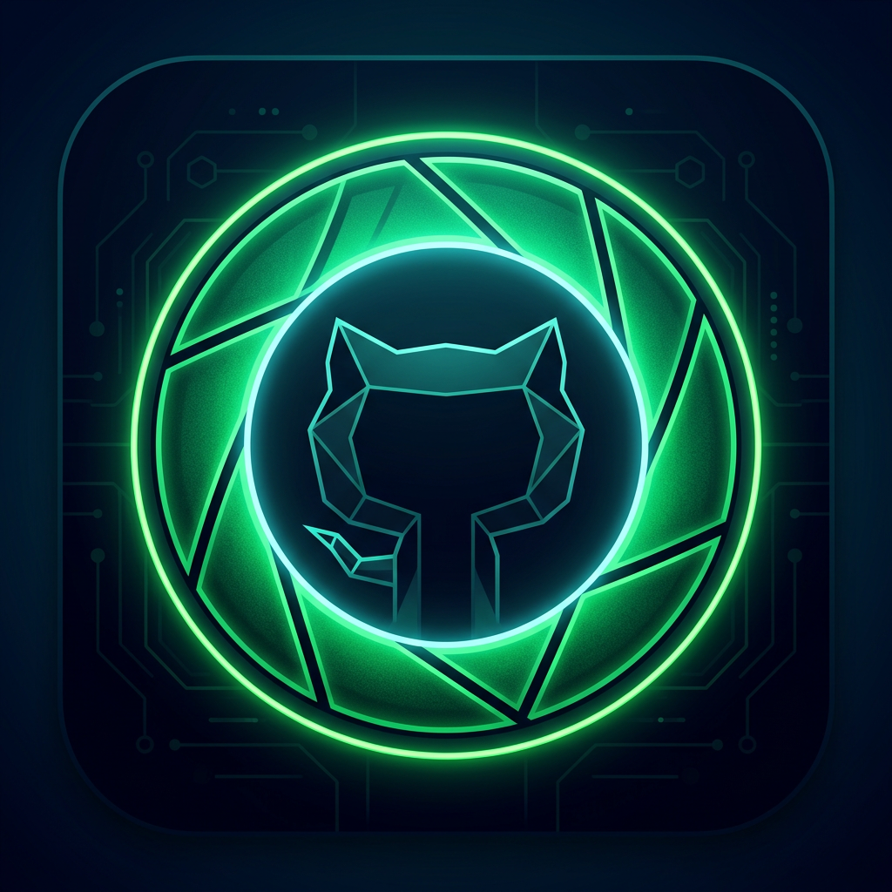
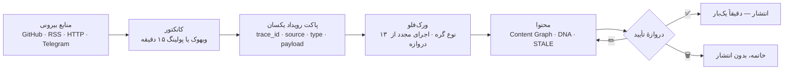
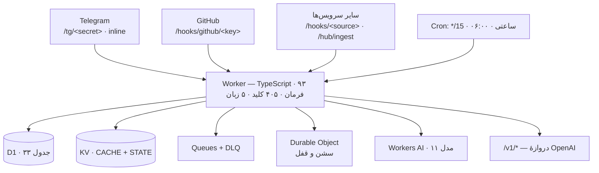

<div align="center" dir="rtl">



# GitHub Lens Ultra

**کاوش، تحلیل، ترجمه، امنیت و دانلود اوپن‌سورس — به‌همراه هاب رویدادمحور با دروازهٔ تأیید انسانی.**

**Cloudflare Workers · D1 · KV · Queues · Durable Objects · Workers AI**

[](https://github.com/Alisarani7021/ghlens-ultra/actions/workflows/ci.yml)
[](https://github.com/Alisarani7021/ghlens-ultra/actions/workflows/deploy.yml)
[](#دروازهٔ-کیفیت)
[](https://www.typescriptlang.org/)
[](https://workers.cloudflare.com/)
[](schema/d1.sql)
[](LICENSE)


**[ربات](https://t.me/Gitguts_bot)** · **[سلامت زنده](https://ghlens-ultra.gitguts.workers.dev/health)** · **[راهنامهٔ فارسی](docs/USAGE-FA.md)** · **[معماری](docs/ARCHITECTURE.md)** · **[هاب](docs/HUB-OS.md)** · **[توکن کلودفلر](docs/CF-TOKEN-FA.md)**

</div>

<div dir="rtl">

```text
«یک کتابخانهٔ صف در Go»      →  جست‌وجوی معنایی (بدون کلیدواژه)
vuejs/core                  →  پرونده: ۱۲ تب · امنیت · جامعه · رشد
/repochat oven-sh/bun       →  پرسش‌وپاسخ از محتوای مخزن، با استناد
/hub → رویداد آزمایشی        →  پیش‌نویس پست کانال → ✅ انتشار
```

## قابلیت‌ها

| بخش | قابلیت |
|---|---|
| **کشف** | جست‌وجوی هیبرید برداری + متنی با RRF · `trending` روزانه/هفتگی/ماهانه/همیشه با رشد واقعی · دسته‌بندی، گنج‌های پنهان، کشف وزن‌دار، فید شخصی |
| **تحلیل** | ۱۲ تب از یک کوئری GraphQL: رشد ۳۰ روزه، ضریب اتوبوس، نرخ مرج، دارایی‌های انتشار، CI، امنیت · مقایسهٔ مخازن · نمودار · مرور فایل داخل تلگرام |
| **هوش مصنوعی** | ۱۱ مدل در ۳ رده + ردهٔ چندمدلی (موازی → داور → سنتز) · چت با مخزن (RAG با منبع) · ترجمهٔ README با حفظ ساختار، صفحه‌بندی تا آخر · ورک‌فلو، بازبینی PR، توضیح کد |
| **دانلود و امنیت** | دانلود مستقیم با کش و تقسیم جریانی · اسکن وابستگی با OSV · شکار کلید لو‌رفته · CVE · تبدیل پکیج (deb ⇄ rpm ⇄ pacman ⇄ apk) |
| **ابزار** | IP/DNS/ASN/TLS، CIDR، JWT، هش، UUID، کرون، رجکس، SemVer · رادار شبکه |
| **حساب** | پروفایل، XP، نشان، رتبهٔ هفتگی، ارجاع، داشبورد ۳۰ روزه · `/keys` استخر کلیدهای اهدایی (تست قبل از پذیرش، حذف خودکار کلید مرده) · `/connect` اتصال گیت‌هاب با توکن کم‌دسترسی |
| **رابط** | ۵ زبان کامل — fa · en · ar · ru · zh · حالت inline · **سند Rich در تمام ربات**: همهٔ صفحه‌ها (هر پیامی که با `reply` می‌رود) به‌طور خودکار به سند تبدیل می‌شوند — تیتر، فهرست، نقل‌قول، کد — با fallback خودکار به متن ساده (تقسیم پیام‌های بلند و نجات ویرایش‌های ناموفق) · منوی دوصفحه‌ای · لایهٔ اموجی پریمیوم (custom emoji در متن‌ها و آیکون دکمه‌ها با fallback خودکار) |

## هاب رویدادمحور

قاعدهٔ معماری یک جمله است: **سرویس جدید → کانکتور → رویداد + اکشن → گذرگاه مشترک.** هیچ قابلیتی به روتر ربات چسبانده نمی‌شود.



| لایه | نقش |
|---|---|
| `event.ts` | پاکت یکسان + `trace_id`؛ وبهوک و پولینگ یک رویداد تولید می‌کنند، پس پایین‌دست منبع را نمی‌شناسد |
| `connectors.ts` | github · rss · http · telegram — تست واقعی، دریافت دستی، کش شرطی |
| `engine.ts` | ۱۳ گره: trigger · ai · compose.release · http · transform · condition · policy · content · approval · connector · notify · delay · stop |
| `policy.ts` | تکرار (شباهت متنی)، خفه‌سازی، ساعات سکوت، اجازهٔ انتشار |
| `content.ts` | نسخه‌بندی، Content DNA، تشخیص STALE |
| `editor.ts` | متن کانال: هدر، نقل‌قول، خط دانلود، **یک دکمه برای هر دارایی + دکمهٔ پروژه** |
| `hooks.ts` | دریافت‌کنندهٔ وبهوک: HMAC-SHA256 (GitHub/Stripe/عمومی)، مقایسهٔ زمان‌ثابت، رد رویداد تکراری |
| `gateway.ts` | `/v1/chat/completions` و `/v1/models` سازگار با OpenAI، احراز کلید، استریم SSE |
| `files.ts` · `media.ts` · `knowledge.ts` | کالبدشکافی فایل · کاور SVG + پرامپت + alt · گراف دانش و جست‌وجوی معنایی |
| `mesh.ts` · `mission.ts` | چند مدل با داور و سنتز · یک جملهٔ طبیعی → ورک‌فلوی اجرایی |
| `deploy.ts` | راه‌اندازی یک‌کلیکی روی حساب کلودفلرِ خودِ کاربر: توکن → منابع → مهاجرت → آپلود → وبهوک → سلامت |

**تضمین‌ها**

- **دقیقاً یک انتشار:** تأیید انسانی مسیر را پیش از ارسال مصرف می‌کند؛ پست تکراری ممکن نیست (تست زنده: از مسیر تأیید، یک `sendMessage`).
- **۴۰۱ پیش از پارس:** امضای نامعتبر پیش از خواندن بدنه رد می‌شود؛ مقایسهٔ امضا زمان‌ثابت است.
- **بدون سرور جانبی:** بردارها (۱۰۲۴ بعدی `bge-m3`) داخل D1 ذخیره می‌شوند و شباهت کسینوسی در SQL محاسبه می‌شود؛ جست‌وجوی معنایی به Vectorize وابسته نیست.
- **پایداری فراخوانی‌ها:** Telegram 429/5xx با احترام به `retry_after` دوباره تلاش می‌شود؛ در AI، مدارشکن با سقف نویرون روزانه و زنجیرهٔ جایگزین مدل‌ها.
- **قفل سشن:** هر کاربر یک Durable Object دارد؛ دو درخواست هم‌زمان یک وضعیت را خراب نمی‌کنند.

## معماری



`/health` بایندینگ‌ها را گزارش می‌دهد، `/health?deep=<secret>` هشت probe واقعی (D1 · KV · Telegram · GitHub · AI · بردار · صف · DO) و `/health?cron=1` ضربان زمان‌بند را.

## اعداد

| | |
|---|---|
| سطح ربات | ۹۳ فرمان · ۴۰۵ کلید دکمه‌ای · ۵ زبان · ۳ کرون |
| کد | ۶۵ فایل TypeScript · ~۲۰٬۸۰۰ خط · ۲۲ ماژول کاربری · ۱۷ ماژول هاب |
| داده | ۳۳ جدول · ۴۲ ایندکس · ۷۵ دستور اسکیمای تولیدشده |
| کیفیت | ۲۶۲ تست · ۶ سرویس کلودفلر (Workers · D1 · KV · Queues · DO · AI) |

## راه‌اندازی

```bash
# ۱) ساده‌ترین راه: از داخل ربات
#    /hub → ساخت نمونهٔ شخصی → توکن کلودفلر → همه‌چیز خودکار ساخته می‌شود

# ۲) با CI/CD: دو سکرت مخزن را بگذار
#    CLOUDFLARE_API_TOKEN · CLOUDFLARE_ACCOUNT_ID
#    هر پوش به main → تست → انتشار → تست سلامت

# ۳) دستی
git clone https://github.com/Alisarani7021/ghlens-ultra && cd ghlens-ultra
npm ci
./scripts/bootstrap.sh     # منابع کلودفلر + اسکیمای D1 + انتشار
./scripts/set-secrets.sh   # BOT_TOKEN · GITHUB_TOKEN · کلیدهای CF
npx wrangler deploy
WORKER_URL=https://ghlens-ultra.<sub>.workers.dev ./scripts/set-webhook.sh
```

[`docs/DEPLOY.md`](docs/DEPLOY.md) · [`docs/USAGE-FA.md`](docs/USAGE-FA.md) · [`docs/CF-TOKEN-FA.md`](docs/CF-TOKEN-FA.md)

## دروازهٔ کیفیت

```bash
bash scripts/check.sh
# gen-schema → schema.gen.ts از schema/d1.sql (۷۵ دستور · ۳۳ جدول · ۴۲ ایندکس)
# typecheck  → strict، صفر خطا
# sqlcheck   → تطابق تعداد ? با bind() در هر دستور SQL
# dup-keys   → یکتایی کلید همهٔ دکمه‌ها
# cb-audit   → هر کلید دکمه‌ای که صفحه می‌سازد، شاخهٔ روتر دارد
# selftest   → ۳۴۵ تست الگوریتمی
```

همین دروازه در CI روی هر push و PR اجرا می‌شود؛ استقرار، پس از انتشار، سلامت و ضربان زمان‌بند را روی نسخهٔ زنده بررسی می‌کند.

## مرزها

| محدودیت | رفتار |
|---|---|
| سقف آپلود تلگرام: ۵۰MB | تقسیم جریانی؛ برای مخزن‌های بزرگ‌تر، آفلاود اختیاری به مخزن کمکی Actions |
| سهمیهٔ روزانهٔ Workers AI | زنجیرهٔ ۱۱ مدلی + کش + استخر کلید کاربران؛ در صورت اتمام، دلیل به کاربر اعلام می‌شود |
| سقف کرون حساب رایگان: ۵ | این پروژه ۳ کرون مصرف می‌کند |
| بدون خروجی صوتی | هیچ مسیر TTS یا صدا در ربات وجود ندارد؛ ویسِ ورودی به متن تبدیل می‌شود |
| تصاویر | فهرست می‌شوند؛ توصیف مدل نمی‌شوند |
| PDF اسکن‌شده | OCR ندارد؛ نبود متن صریحاً گزارش می‌شود |
| `/v1/embeddings` | مسیر HTTP ندارد؛ embedding داخلی و ذخیره در D1 است |
| بیرون از دامنه | ابزار دوکسینگ یا OSINT روی افراد واقعی وجود ندارد |

## چیدمان

```text
src/
  index.ts   روتر ۹۳ فرمان · وبهوک · دروازهٔ OpenAI · سلامت · لندینگ
  tg/        کلاینت Bot API · کیبوردها (۵ زبان)      github/  REST+ETag · GraphQL · ترند · OSV
  ai/        زنجیرهٔ مدل‌ها · استخر کلید · بردار        core/    D1 · KV · سشن DO · صف · کرون
  features/  ۲۲ ماژول کاربری                          hub/     ۱۷ ماژول هاب
schema/d1.sql · scripts/ · actions/pack-repo.yml · docs/
```

## مجوز

MIT — [LICENSE](LICENSE). داده از APIهای عمومی گیت‌هاب، OSV.dev، RDAP و DNS-over-HTTPS، هر یک تابع شرایط خودش.

</div>

---

# English

**GitHub Lens Ultra** — an open-source observatory for Telegram, on Cloudflare Workers: 93 commands, 416 glass labels, 202 routed callback keys, 33 D1 tables, 310 tests, 5 UI languages. **[Bot](https://t.me/Gitguts_bot)** · **[Health](https://ghlens-ultra.gitguts.workers.dev/health)**

**Core** — hybrid semantic + lexical search (1024-dim `bge-m3` embeddings stored **in D1**, cosine similarity in SQL, no Vectorize dependency) · 12-tab dossier from a single GraphQL query (growth, bus factor, merge rate, releases, CI, security) · repo chat with citations · structure-preserving README translation · direct downloads with streaming splits · OSV dependency scans, leaked-key hunting, CVE alerts · package conversion (deb ⇄ rpm ⇄ pacman ⇄ apk).

**AI** — 11 Workers AI models in 3 tiers plus a multi-model jury (parallel → critic → synthesis), a circuit breaker over the daily neuron budget, aggressive deterministic caching, and a donated-key pool that evicts dead keys. An OpenAI-compatible gateway (`/v1/chat/completions`, `/v1/models`, SSE) is exposed with per-key auth.

**Hub** — a new service becomes a connector, then events and actions, then everything rides one bus: connectors (github · rss · http · telegram) emit an identical event envelope with a `trace_id` whether they arrive by webhook or poll, so nothing downstream knows the difference. Workflows run 13 node kinds and resume from the approval gate; content is versioned with DNA and STALE detection; the human gate can publish (exactly once), edit, or reject. The webhook receiver verifies HMAC-SHA256 with a constant-time compare and rejects replays **before** parsing the body. One-click self-hosting provisions KV, D1, Queues, secrets, crons and the Telegram webhook on someone else's Cloudflare account.

**Run it** — From the bot (`/hub → self-host`), via GitHub Actions (two repository secrets), or manually: `npm ci && ./scripts/bootstrap.sh && ./scripts/set-secrets.sh && npx wrangler deploy`. Gate: `bash scripts/check.sh`.

**Limits** — Telegram's 50 MB upload cap (streaming split, optional Actions offload); a daily free Workers AI quota (chained models, caching, user-donated keys); 3 of the account's 5 cron triggers; no audio output of any kind; images catalogued but not model-described; scanned PDFs not OCR'd; no HTTP `/v1/embeddings`; and no doxxing or OSINT tooling on real people.

MIT © 2026 — [LICENSE](LICENSE)
